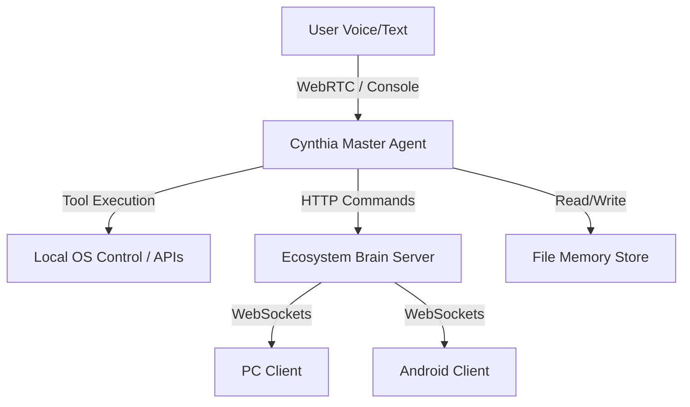

# Cynthia: Distributed Personal AI Assistant

Cynthia is a professional, production-grade, low-latency, real-time voice-driven AI assistant. Built upon LiveKit's WebRTC agent framework and powered by Google's Gemini Realtime API, Cynthia acts as a centralized "Master Brain" capable of executing system tasks, orchestrating dynamic memory, and controlling an ecosystem of distributed client devices (PCs, tablets, mobiles) over WebSockets.

---

## Overview

Cynthia combines high-speed vocal interaction with rich local and remote device capabilities. She inherits the tool-based capabilities of legacy technical assistants while maintaining a warm, responsive, and calm female persona. Whether communicating via Hinglish or English, Cynthia remembers details, learns user habits, schedules tasks, writes code, manages files, and interfaces directly with your Windows OS and external APIs.

---

## Key Features

* **Real-Time Vocal Interaction**: Sub-second voice response time using LiveKit WebRTC channels and Gemini's Realtime Beta.
* **Smart Key & Model Rotation**: Transparently manages multiple Gemini API keys and automatically rotates them upon encountering rate limits (429/quota errors) or model incompatibilities.
* **Distributed Device Ecosystem**: Coordinates remote commands across registered clients (such as PCs and Kivy-powered Android devices) using a FastAPI WebSocket registry.
* **Persistent Dynamic Memory**: Structured, file-based memory store (`memory.json`) tracking user profiles, life phases, hobbies, habits, tasks, projects, and emotional states.
* **Deep Windows System Control**: Adjusts volume and screen brightness, arranges desktop windows, captures screenshots, and opens/closes applications visually or via keyboard shortcuts.
* **Integrations & Automation**: WhatsApp messaging/calling, OpenWeatherMap integration, SerpAPI Google Search, file-based document translation, and automated workflow triggers.

---

## Architecture Overview

Cynthia operates on a Hub-and-Spoke model where your laptop serves as the **Master Brain**:



1. **Master Agent (`agent.py`)**: Connects to LiveKit RTC rooms and streams microphone audio to Gemini's Realtime model.
2. **Brain Server (`device_server.py`)**: A central FastAPI HTTP and WebSocket server broker registering and routing commands to remote devices.
3. **Ecosystem Clients (`pc_client.py` & `android_client.py`)**: Remote client scripts running on separate physical hardware that execute shell tasks, trigger web browser navigation, or fetch device status.
4. **Memory Store (`memory_store.py`)**: The database controller managing local JSON files.

---

## Technology Stack

* **Core Runtime**: Python 3.11
* **Vocal RTC**: `livekit` & `livekit-agents`
* **Large Language Model**: `google-genai` (Gemini API)
* **Web Framework & Broker**: `fastapi`, `uvicorn`, `websockets`
* **Desktop Automation**: `pywin32`, `pycaw`, `screen-brightness-control`, `PyAutoGUI`, `PyGetWindow`, `psutil`
* **Visual Reports**: `pillow`, `matplotlib`, `pandas`, `numpy`
* **Mobile GUI**: `kivy`, `plyer`
* **Development & Tunneling**: `python-dotenv`, `pyngrok`, `qrcode`

---

## Folder Structure

```
.
├── .github/                   # GitHub Action workflows and issue templates
├── config/                    # Compiled internal configurations
├── docs/                      # Markdown system manuals and designs
├── document_qa/               # Document parsing engine
├── document_understanding/    # Advanced text understanding modules
├── examples/                  # Reference examples and starter workflows
├── public/                    # Static UI resources
├── rag_module/                # RAG (Retrieval-Augmented Generation) code
├── scripts/                   # Auxiliary dev and deployment scripts
├── services/                  # Refactored business logic modules
├── src/                       # Replica of core executable files
├── templates/                 # HTML UI layouts for device management
├── tests/                     # Test harness, configurations, and test suites
├── utils/                     # Reusable utilities (e.g. system control wrappers)
├── visualizations/            # Output directory for generated charts
├── voice_data/                # Synthetic speech wav templates
├── agent.py                   # Main LiveKit Voice Agent entrypoint
├── device_server.py           # FastAPI Web & WebSocket Brain Server
├── gemini_key_manager.py      # Gemini API key and model rotation manager
├── launcher.py                # Ecosystem bootstrap and Ngrok QR-code engine
├── memory_store.py            # Local JSON memory database driver
├── pc_client.py               # Local background PC executor client
├── prompts.py                 # Core system prompts & personality templates
├── requirement.txt            # Python dependencies list
└── run_*.bat                  # Batch files for Windows launchers
```

---

## Installation Guide

### Prerequisites

* Python 3.11 (Ensure it is added to your environment `PATH`).
* Windows 10/11 (Required for system control, audio APIs, and desktop integrations).
* A LiveKit Cloud Project or Self-Hosted LiveKit Server.
* One or more Google Gemini API keys.

### Local Setup

1. **Clone the Repository**:
   ```bash
   git clone https://github.com/your-username/femle-best-friend.git
   cd femle-best-friend
   ```

2. **Initialize a Virtual Environment**:
   ```bash
   python -m venv venv311
   # Activate on Windows:
   .\venv311\Scripts\activate
   ```

3. **Install Dependencies**:
   ```bash
   pip install -r requirement.txt
   ```

4. **Environment Variables**:
   Copy `.env.example` to `.env` and fill in your API credentials:
   ```bash
   copy .env.example .env
   ```

---

## Environment Variables

Key parameters in `.env` (or `.env.local`):

| Variable Name | Description | Default / Example |
| ------------- | ----------- | ----------------- |
| `ASSISTANT_NAME` | The assistant's name | `Cynthia` |
| `ASSISTANT_VOICE` | The voice profile used by LiveKit | `Aoede` |
| `PLAY_STARTUP_SOUND` | Enable/disable non-blocking Windows startup chime | `false` |
| `GEMINI_API_KEYS` | Comma-separated API keys for rotation | `key1,key2` |
| `SERPAPI_API_KEY` | Key for Web Search capabilities | `your_serpapi_key` |
| `OPENWEATHER_API_KEY`| Key for Weather status updates | `your_weather_key` |
| `LIVEKIT_URL` | LiveKit cloud instance URL | `wss://...` |
| `LIVEKIT_API_KEY` | LiveKit application key | `api_key` |
| `LIVEKIT_API_SECRET` | LiveKit secret key | `secret_key` |

---

## Running the Project

### 1. Launch the Assistant Voice Channel

Run the assistant in live audio stream mode:
```bash
run_assistant_console.bat
```
Alternatively, for text-only terminal debugging:
```bash
run_assistant_text.bat
```

### 2. Run the Multi-Device Ecosystem

Run the entire ecosystem, which spawns the Brain Server, starts the local PC client, tunnels the connection via Ngrok, and prints connection QR codes for remote mobile clients:
```bash
run_ecosystem.bat
```
*(Or manually run `python launcher.py` in your terminal).*

---

## API Overview (Brain Server)

The FastAPI server (`device_server.py`) exposes several endpoints:

* **WebSocket Channel**: `WS /ws/{device_id}`
  Handles bidirectional registry notifications, keep-alive heartbeats, and commands.
* **Web UI Dashboard**: `GET /mobile`
  HTML-based device management and control interface.
* **Execute Command**: `POST /send_command`
  Dispatch target actions to specific devices.
* **Broadcast**: `POST /broadcast`
  Emit command events to all connected clients.

---

## Memory System Overview

Cynthia uses a custom, multi-tier JSON document schema driven by `memory_store.py`:

```json
{
  "user_profile": { "name": "Dev Sharma", "communication_style": "Hinglish, Direct" },
  "life_phases": { "current_phase": "Unknown", "goals": [] },
  "facts": { "hobbies": [ { "text": "Coding", "confidence": 1.0, "count": 1 } ] },
  "habits": [],
  "schedule": [],
  "emotional_context": { "current_state": "Neutral" }
}
```

* **Facts & Confidence**: Learns statements about the user and increases confidence over recurring interactions.
* **Habits**: Automatically registers repeated sequences of actions.
* **State Updates**: Dynamically adapts behavior based on current emotional context.

---

## Deployment Guide

The FastAPI server component can be deployed using Docker.

### Docker Deployment

1. **Build the Docker Image**:
   ```bash
   docker build -t cynthia-brain-server .
   ```

2. **Run via Docker Compose**:
   Ensure ports and volumes are mapped correctly in `docker-compose.yml`, then start:
   ```bash
   docker-compose up -d
   ```

---

## Troubleshooting

* **WinError 64 (Network Name Dropped)**: This is normal when the LiveKit WebRTC connection terminates. Cynthia handles this gracefully, silently reconnecting.
* **PortAudio / Sound Device Errors**: Ensure you have audio devices properly set up in Windows settings and that no other process is locking your microphone.
* **Ngrok Authentication Errors**: If the remote tunnel fails to start, sign up for a free Ngrok token and run `ngrok config add-authtoken <token>` in your terminal.

---

## Contributing

For information on contributing, please read [CONTRIBUTING.md](CONTRIBUTING.md).

---

## License

This project is licensed under the MIT License - see the [LICENSE](LICENSE) file for details.
