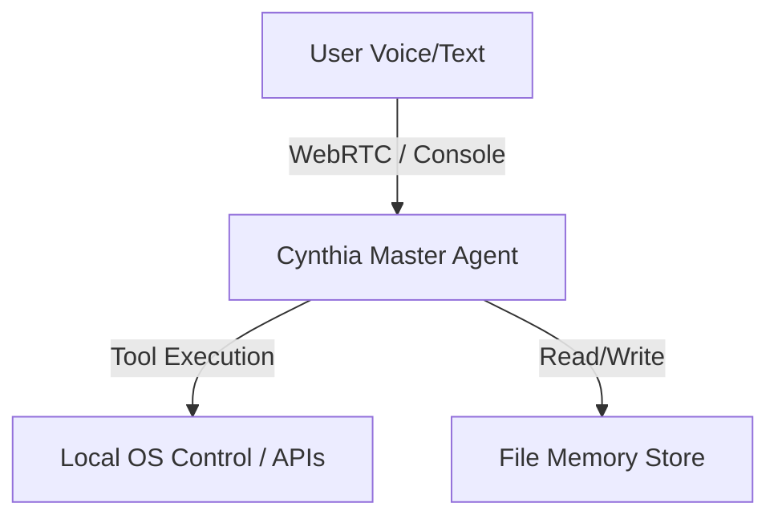

# Cynthia: Local Personal AI Assistant

Cynthia is a low-latency, real-time voice-driven AI assistant for your Windows laptop/PC. Built upon LiveKit's WebRTC agent framework and powered by Google's Gemini Realtime API, Cynthia controls your local machine, remembers context about you, and helps you get things done by voice or text.

---

## Overview

Cynthia combines high-speed vocal interaction with local system control. She inherits the tool-based capabilities of legacy technical assistants while maintaining a warm, responsive, and calm female persona. Whether communicating via Hinglish or English, Cynthia remembers details, learns user habits, writes text/code, manages files, and interfaces directly with your Windows OS and external APIs.

---

## Key Features

* **Real-Time Vocal Interaction**: Sub-second voice response time using LiveKit WebRTC channels and Gemini's Realtime Beta.
* **Smart Key & Model Rotation**: Transparently manages multiple Gemini API keys and automatically rotates them upon encountering rate limits (429/quota errors) or model incompatibilities.
* **Persistent Dynamic Memory**: Structured, file-based memory store (`memory.json`) tracking user profiles, life phases, hobbies, habits, projects, and emotional states.
* **Deep Windows System Control**: Adjusts volume and screen brightness, arranges desktop windows, captures screenshots, opens/closes applications, and creates/finds files and folders.
* **Screen Understanding / Vision**: Reads and explains what's on screen, locates UI elements, and detects error popups using Gemini Vision.
* **Human-Like Computer Control**: Clicks, types, and navigates GUI apps using vision-guided, keyboard-first automation.
* **Content Writing**: Dictates and types text or starter code directly into an editor.
* **WhatsApp Text Messaging**: Sends a WhatsApp text message to a named contact (desktop app automation). File sharing, reading messages, replying, and calling are not supported.
* **Smart Reply Suggestions**: Can generate suggested Hinglish reply options and a safety-level recommendation for a given incoming message — these are suggestions only; Cynthia does not send them automatically.
* **Integrations & Automation**: OpenWeatherMap integration, SerpAPI Google Search, file-based document translation, lightweight task/project tracking, and user-defined workflow triggers.

---

## Architecture Overview

Cynthia runs entirely on your local machine:



1. **Master Agent (`agent.py`)**: Connects to LiveKit RTC rooms and streams microphone audio to Gemini's Realtime model.
2. **Memory Store (`memory_store.py`)**: The database controller managing local JSON files.
3. **Tool modules** (root-level `*_tools.py` files): System control, file management, WhatsApp messaging, vision, translation, content writing, etc.

---

## Technology Stack

* **Core Runtime**: Python 3.11
* **Vocal RTC**: `livekit` & `livekit-agents`
* **Large Language Model**: `google-genai` (Gemini API)
* **Desktop Automation**: `pywin32`, `pycaw`, `screen-brightness-control`, `PyAutoGUI`, `PyGetWindow`, `psutil`
* **Vision**: `pillow`, `google-generativeai`
* **Translation**: `deep-translator`
* **Search**: SerpAPI (`requests`-based)

---

## Folder Structure

```
.
├── .github/                   # GitHub Action workflows and issue templates
├── services/                  # Older parallel copies of some tool modules (not imported by agent.py)
├── src/                       # Older parallel copies of core executable files (not imported by agent.py)
├── tests/                     # Test harness, configuration, and test suites
├── utils/                     # Reusable utilities (e.g. system control wrappers)
├── agent.py                   # Main LiveKit Voice Agent entrypoint
├── gemini_key_manager.py      # Gemini API key and model rotation manager
├── memory_store.py            # Local JSON memory database driver
├── prompts.py                 # Core system prompts & personality templates
├── requirement.txt            # Python dependencies list
└── run_assistant_*.bat        # Batch files for Windows launchers
```

Note: `services/` and `src/` contain earlier, parallel copies of some tool files that `agent.py` does not import at runtime. They are kept around intentionally rather than deleted outright; only files confirmed to be 100%-identical duplicates of a root file have been removed from them.

---

## Installation Guide

### Prerequisites

* Python 3.11 (Ensure it is added to your environment `PATH`).
* Windows 10/11 (Required for system control, audio APIs, and desktop integrations).
* A LiveKit Cloud Project or Self-Hosted LiveKit Server.
* One or more Google Gemini API keys.

### Local Setup

1. **Clone the Repository**:
   ```bash
   git clone https://github.com/your-username/femle-best-friend.git
   cd femle-best-friend
   ```

2. **Initialize a Virtual Environment**:
   ```bash
   python -m venv venv311
   # Activate on Windows:
   .\venv311\Scripts\activate
   ```

3. **Install Dependencies**:
   ```bash
   pip install -r requirement.txt
   ```

4. **Environment Variables**:
   Copy `.env.local.example` to `.env.local` and fill in your API credentials.

---

## Environment Variables

Key parameters in `.env.local`:

| Variable Name | Description | Default / Example |
| ------------- | ----------- | ----------------- |
| `ASSISTANT_NAME` | The assistant's name | `Cynthia` |
| `ASSISTANT_VOICE` | The voice profile used by LiveKit | `Aoede` |
| `PLAY_STARTUP_SOUND` | Enable/disable non-blocking Windows startup chime | `false` |
| `GEMINI_API_KEYS` | Comma-separated API keys for rotation | `key1,key2` |
| `GEMINI_LIVE_MODEL` | Gemini Live model to pin (Google retires old ones periodically) | `gemini-3.1-flash-live-preview` |
| `TOOL_MODE` | `core` (default, faster) or `full` (also loads vision/workflow tools) | `core` |
| `SERPAPI_API_KEY` | Key for Web Search capabilities | `your_serpapi_key` |
| `OPENWEATHER_API_KEY`| Key for Weather status updates | `your_weather_key` |
| `LIVEKIT_URL` | LiveKit cloud instance URL | `wss://...` |
| `LIVEKIT_API_KEY` | LiveKit application key | `api_key` |
| `LIVEKIT_API_SECRET` | LiveKit secret key | `secret_key` |

---

## Running the Project

Run the assistant in live audio stream mode:
```bash
run_assistant_console.bat
```
Alternatively, for text-only terminal debugging:
```bash
run_assistant_text.bat
```

---

## Memory System Overview

Cynthia uses a custom, multi-tier JSON document schema driven by `memory_store.py`:

```json
{
  "user_profile": { "name": "Dev Sharma", "communication_style": "Hinglish, Direct" },
  "life_phases": { "current_phase": "Unknown", "goals": [] },
  "facts": { "hobbies": [ { "text": "Coding", "confidence": 1.0, "count": 1 } ] },
  "habits": [],
  "emotional_context": { "current_state": "Neutral" }
}
```

* **Facts & Confidence**: Learns statements about the user and increases confidence over recurring interactions.
* **Habits**: Automatically registers repeated sequences of actions.
* **State Updates**: Dynamically adapts behavior based on current emotional context.

---

## Troubleshooting

* **WinError 64 (Network Name Dropped)**: This is normal when the LiveKit WebRTC connection terminates. Cynthia handles this gracefully, silently reconnecting.
* **PortAudio / Sound Device Errors**: Ensure you have audio devices properly set up in Windows settings and that no other process is locking your microphone.

---

## Contributing

For information on contributing, please read [CONTRIBUTING.md](CONTRIBUTING.md).

---

## License

This project is licensed under the MIT License - see the [LICENSE](LICENSE) file for details.
